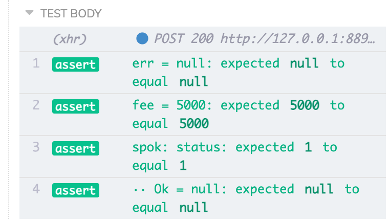
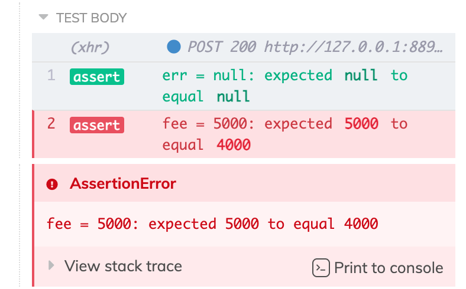

# spok [](https://github.com/thlorenz/spok/actions)

Checks a given object against a given set of specifications to keep you from writing boilerplate tests.

```js
const test = require('node:test') 
// or: const test = require('tape') 
// or: const test = require('tap') 
const spok = require('spok')

// this would be returned from a function you are testing
const object = {
    one          : 1
  , two          : 2
  , three        : 3
  , four         : 4
  , helloWorld   : 'hello world'
  , anyNum       : 999
  , anotherNum   : 888
  , anArray      : [ 1, 2 ]
  , anotherArray : [ 1, 2, 3 ]
  , anObject     : {}
}

// custom specification
function hasThreeElements(a) {
  return a.length === 3
}

test('my object meets the specifications', (t) => {
  spok(t, object, {
      $topic      : 'spok-example'
    , one          : spok.ge(1)
    , two          : 2
    , three        : spok.range(2, 4)
    , four         : spok.lt(5)
    , helloWorld   : spok.startsWith('hello')
    , anyNum       : spok.type('number')
    , anotherNum   : spok.number
    , anArray      : spok.array
    , anotherArray : hasThreeElements
    , anObject     : spok.ne(undefined)
  })
})
```


## Installation

    npm install spok

## Node.js Test Runner

Since Node.js 16.x it includes a built-in [test runner](https://nodejs.org/docs/latest/api/test.html).

Spok support this out of the box as follows:

- it uses the build-in `assert` module to assert the values
- it uses the passed `t: TestContext` to print diagnostic messages that detail the assertions
  mad

See [./example/node-test.js](./example/node-test.js) and [./example/node-test-nested.js](./example/node-test-nested.js)for a full examples.

### Colors 

_spok_ detects if colors should be used in the output in order to avoid breaking TAP
compatibility when needed as follows:

- if `FORCE_COLOR` env var is set to `1|true` colors are ALWAYS
- if `NO_COLOR` env var is set to `1|true` colors are NEVER used
- if tests are executed via `node --test mytest.js` and `FORCE_COLOR` is not set then colorse are disabled
- if tests are executed via `node mytest.js` and `NO_COLOR` is not set then colors are enabled


## Tap/Tape

- tap and tape provide a `t` which mirrors the `assert` module and also prints results and the
  diagnostics message to the console, thus spok uses `t` to perform assertions

See [./example/tape.js](./example/tape.js) and [./example/tape-nested.js](./example/tape-nested.js)for a full examples.

## Cypress/Chai Expect Support

Spok can be used out of the box with `expect`, for instance when running tests with
[cypress.io](https://cypress.io).

Simply create a custom assert function and pass it to spok. The main difference to running
tests with `tape` is that if a single property in the compared object doesn't match the test
fails immediately.

```js
import spok from 'spok'
const t = spok.adapters.chaiExpect(expect)
```

```js
spok(t, meta, {
  err: null,
  fee: 5000,
  status: {
    Ok: null,
  },
})
```



```js
spok(t, meta, {
  err: null,
  fee: 4000,
  status: {
    Ok: null,
  },
})
```



## Why not just `deepEqual`?

`deepEqual` works great for most cases, but in some cases you need more control, i.e.

-   values don't exactly match, but are in a given range
-   you want to provide a predicate to determine if a value is correct or not
-   you only want to check a subset of values contained in the object

## Adjusting Print Details

By default spok prints the specification that a particular assertion satisified, i.e. `satisfies: spok.range(2, 4)`.
You can turn that off via `spok.printSpec = false`.

On the other hand if you want more details about the satisified spec do `spok.printDescription = true` instead to get
spok to print things like `satisfies: spok.range(2, 4) 2 <= value <= 4`.

Specs and descriptions are printed in gray so you can focus on the actual values of the test output.

<!-- START doctoc generated TOC please keep comment here to allow auto update -->
<!-- DON'T EDIT THIS SECTION, INSTEAD RE-RUN doctoc TO UPDATE -->
**Table of Contents**  *generated with [DocToc](https://github.com/thlorenz/doctoc)*

- [API](#api)
  - [spok](#spok)
  - [spok.any](#spokany)
  - [spok.range](#spokrange)
  - [spok.gt](#spokgt)
  - [spok.ge](#spokge)
  - [spok.lt](#spoklt)
  - [spok.le](#spokle)
  - [spok.ne](#spokne)
  - [spok.gtz](#spokgtz)
  - [spok.gez](#spokgez)
  - [spok.ltz](#spokltz)
  - [spok.lez](#spoklez)
  - [spok.type](#spoktype)
  - [spok.array](#spokarray)
  - [spok.arrayElements](#spokarrayelements)
  - [spok.arrayElementsRange](#spokarrayelementsrange)
  - [spok.number](#spoknumber)
  - [spok.string](#spokstring)
  - [spok.function](#spokfunction)
  - [spok.definedObject](#spokdefinedobject)
  - [spok.startsWith](#spokstartswith)
  - [spok.endsWith](#spokendswith)
  - [spok.test](#spoktest)
  - [spok.defined](#spokdefined)
  - [spok.notDefined](#spoknotdefined)
- [License](#license)

<!-- END doctoc generated TOC please keep comment here to allow auto update -->

spok provides a few common specification functions. However you can write your own functions as well, just return `true`
if specification was satisfied and `false` if not (see example above).

If you write a specification function that would be useful to others please add it along with a test and provide a PR.

`spok.*` comparison function names are derived from [**bash** comparison
operators](http://www.tldp.org/LDP/abs/html/comparison-ops.html) to make them easier to remember.

## [API](https://thlorenz.github.io/spok)

<!-- Generated by documentation.js. Update this documentation by updating the source code. -->

### spok

Checks the given specifications against the object.

When the tests are run the **actual** values are printed to verify visually while
each provided specification is validated and a test failure caused if one of them fails.

**Parameters**

-   `t` **[Object](https://developer.mozilla.org/en-US/docs/Web/JavaScript/Reference/Global_Objects/Object)** which has assertion functions `equal` and `deepEqual` (to compare objects) - use
    **tap**, **tape**, **assert**, **Node.js TestContext** or any other library that has those and thus is compatible
-   `obj` **[Object](https://developer.mozilla.org/en-US/docs/Web/JavaScript/Reference/Global_Objects/Object)** the object to verify the specifications against
-   `specifications` **[Object](https://developer.mozilla.org/en-US/docs/Web/JavaScript/Reference/Global_Objects/Object)** the specifications to verify

### spok.any

Version of `spok` that is less strict about the relation of the
specification type, namely it allows overriding the type manually or
derives it from the supplied parameter.

Use ONLY when you cannot adjust the types, so plain `spok` works.

### spok.range

Specififies that the given number is within the given range, i.e. `min<= x <=max`.

```js
var spec = {
 x: spok.range(1, 2)   // specifies that x should be >=1 and <=2
}
```

**Parameters**

-   `min` **[Number](https://developer.mozilla.org/en-US/docs/Web/JavaScript/Reference/Global_Objects/Number)** minimum
-   `max` **[Number](https://developer.mozilla.org/en-US/docs/Web/JavaScript/Reference/Global_Objects/Number)** maximum

### spok.gt

Specififies that a number is greater than the given criteria.

```js
var spec = {
 x: spok.gt(1)  // specifies that x should be >1
}
```

**Parameters**

-   `n` **[Number](https://developer.mozilla.org/en-US/docs/Web/JavaScript/Reference/Global_Objects/Number)** criteria

### spok.ge

Specififies that a number is greater or equal the given criteria.

```js
var spec = {
 x: spok.ge(1)  // specifies that x should be >=1
}
```

**Parameters**

-   `n` **[Number](https://developer.mozilla.org/en-US/docs/Web/JavaScript/Reference/Global_Objects/Number)** criteria

### spok.lt

Specififies that a number is less than the given criteria.

```js
var spec = {
 x: spok.lt(1)  // specifies that x should be < 1
}
```

**Parameters**

-   `n` **[Number](https://developer.mozilla.org/en-US/docs/Web/JavaScript/Reference/Global_Objects/Number)** criteria

### spok.le

Specififies that a number is less or equal the given criteria.

```js
var spec = {
 x: spok.le(1)  // specifies that x should be <=1
}
```

**Parameters**

-   `n` **[Number](https://developer.mozilla.org/en-US/docs/Web/JavaScript/Reference/Global_Objects/Number)** criteria

### spok.ne

Specifies that the value is not equal another.

```js
var spec = {
 x: spok.ne(undefined)  // specifies that x should be defined
}
```

**Parameters**

-   `value` **Any** criteria

### spok.gtz

Specifies that the value is greater than zero

```js
var spec = {
  x: spok.gtz
}
```

### spok.gez

Specifies that the value is greater or equal zero

```js
var spec = {
  x: spok.gez
}
```

### spok.ltz

Specifies that the value is less than zero

```js
var spec = {
  x: spok.ltz
}
```

### spok.lez

Specifies that the value is less or equal zero

```js
var spec = {
  x: spok.lez
}
```

### spok.type

Specifies that the input is of a given type.

```js
var spec = {
 x: spok.type('number')  // specifies that x should be a Number
}
```

**Parameters**

-   `t` **[String](https://developer.mozilla.org/en-US/docs/Web/JavaScript/Reference/Global_Objects/String)** expected type

### spok.array

Specifies that the input is an array.

```js
var spec = {
 x: spok.array  // specifies that x should be an Array
}
```

### spok.arrayElements

Specifies that the input is an array with a specific number of elements

var spec = {
 x: spok.arrayElements(2)  // specifies that x should be an Array with 2 elements
}

**Parameters**

-   `n` **[Number](https://developer.mozilla.org/en-US/docs/Web/JavaScript/Reference/Global_Objects/Number)** number of elements

### spok.arrayElementsRange

Specifies that the input is an array with a number of elements in a given range

var spec = {
 x: spok.arrayElementsRange(2, 4)  // specifies that x should be an Array with 2-4 elements
}

**Parameters**

-   `min` **[Number](https://developer.mozilla.org/en-US/docs/Web/JavaScript/Reference/Global_Objects/Number)** min number of elements
-   `max` **[Number](https://developer.mozilla.org/en-US/docs/Web/JavaScript/Reference/Global_Objects/Number)** max number of elements

### spok.number

Specifies that the input of type number and `isNaN(x)` returns `false`.

```js
var spec = {
 x: spok.number  // specifies that x should be a Number
}
```

### spok.string

Specifies that the input is a string.

    var spec = {
      x: spok.string  // specifies that x should be a String
    }

### spok.function

Specifies that the input is a function.

    var spec = {
      x: spok.function  // specifies that x should be a function
    }

### spok.definedObject

Specifies that the input is an object and it is not `null`.

```js
var spec = {
 x: spok.definedObject  // specifies that x is a non-null object
}
```

### spok.startsWith

Specifies that the string starts with the specified substring.

**NOTE**: only available with node.js which has an ES6 `startsWith` function

```js
var spec = {
 x: spok.startsWith('hello')  // specifies that x should start with 'hello'
}
```

**Parameters**

-   `what` **[String](https://developer.mozilla.org/en-US/docs/Web/JavaScript/Reference/Global_Objects/String)** substring the given string should start with

### spok.endsWith

Specifies that the string ends with the specified substring.

**NOTE**: only available with node.js which has an ES6 `endsWith` function

```js
var spec = {
 x: spok.endsWith('hello')  // specifies that x should start with 'hello'
}
```

**Parameters**

-   `what` **[String](https://developer.mozilla.org/en-US/docs/Web/JavaScript/Reference/Global_Objects/String)** substring the given string should start with

### spok.test

Specifies that the string needs to match the given regular expression.

```js
var spec = {
  x: spok.test(/hello$/) // specifies that x should match /hello$/
}
```

**Parameters**

-   `regex` **[RegExp](https://developer.mozilla.org/en-US/docs/Web/JavaScript/Reference/Global_Objects/RegExp)** regular expression against which the string is checked via `test`

### spok.defined

Specifies that a value is defined, i.e. it is neither `null` nor `undefined`.

```js
var spec = {
  x: spok.defined
}
```

### spok.notDefined

Specifies that a value is notDefined, i.e. it is either `null` or `notDefined`.

```js
var spec = {
  x: spok.notDefined
}
```

## License

MIT
