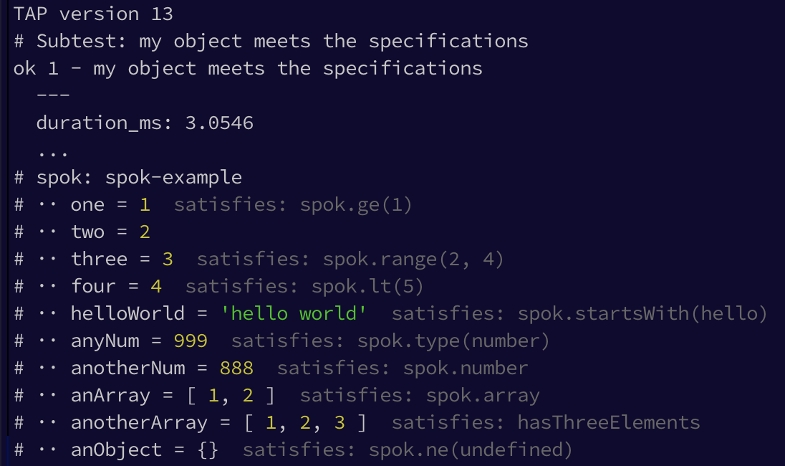

# spok [](http://travis-ci.org/thlorenz/spok)

[](https://ci.testling.com/thlorenz/spok)

Checks a given object against a given set of specifications to keep you from writing boilerplate tests.

```js
var test = require('tape')
var spok = require('spok')

// this would be returned from a function you are testing
var object = {
    one          : 1
  , two          : 2
  , three        : 3
  , four         : 4
  , helloWorld   : 'hello world'
  , anyNum       : 999
  , anotherNum   : 888
  , anArray      : [ 1, 2 ]
  , anotherArray : [ 1, 2, 3 ]
  , anObject     : {}
}

// custom specification
function hasThreeElements(a) {
  return a.length === 3
}

test('my object meets the specifications', function (t) {
  spok(t, object, {
      $topic      : 'spok-example'
    , one          : spok.ge(1)
    , two          : 2
    , three        : spok.range(2, 4)
    , four         : spok.lt(5)
    , helloWorld   : spok.startsWith('hello')
    , anyNum       : spok.type('number')
    , anotherNum   : spok.number
    , anArray      : spok.array
    , anotherArray : hasThreeElements
    , anObject     : spok.ne(undefined)
  })
  t.end()
})
```




## Installation

    npm install spok

## Why not just `deepEqual`?

`deepEqual` works great for most cases, but in some cases you need more control, i.e.

- values don't exactly match, but are in a given range
- you want to provide a predicate to determine if a value is correct or not
- you only want to check a subset of values contained in the object

<!-- START doctoc generated TOC please keep comment here to allow auto update -->
<!-- DON'T EDIT THIS SECTION, INSTEAD RE-RUN doctoc TO UPDATE -->
**Table of Contents**  *generated with [DocToc](https://github.com/thlorenz/doctoc)*

- [API](#api)
    - [spok(t, obj, specifications)](#spokt-obj-specifications)
    - [spok::array(x) → {Boolean}](#spokarrayx-→-boolean)
    - [spok::definedObject() → {Boolean}](#spokdefinedobject-→-boolean)
    - [spok::ge(n)](#spokgen)
    - [spok::gt(n)](#spokgtn)
    - [spok::le(n)](#spoklen)
    - [spok::lt(n)](#spokltn)
    - [spok::ne(value)](#spoknevalue)
    - [spok::number(x) → {Boolean}](#spoknumberx-→-boolean)
    - [spok::range(min, max) → {function}](#spokrangemin-max-→-function)
    - [spok::startsWith(what)](#spokstartswithwhat)
    - [spok::string() → {Boolean}](#spokstring-→-boolean)
    - [spok::type(t)](#spoktypet)
- [License](#license)

<!-- END doctoc generated TOC please keep comment here to allow auto update -->

## API

spok provides a few common specification functions. However you can write your own functions as well, just return `true`
if specification was satisfied and `false` if not (see example above).

If you write a specification function that would be useful to others please add it along with a test and provide a PR.

`spok.*` comparison function names are derived from [**bash** comparison
operators](http://www.tldp.org/LDP/abs/html/comparison-ops.html) to make them easier to remember.


<!-- START docme generated API please keep comment here to allow auto update -->
<!-- DON'T EDIT THIS SECTION, INSTEAD RE-RUN docme TO UPDATE -->

<div>
<div class="jsdoc-githubify">
<section>
<article>
<div class="container-overview">
<dl class="details">
</dl>
</div>
<dl>
<dt>
<h4 class="name" id="spok"><span class="type-signature"></span>spok<span class="signature">(t, obj, specifications)</span><span class="type-signature"></span></h4>
</dt>
<dd>
<div class="description">
<p>Checks the given specifications against the object.</p>
<p>When the tests are run the <strong>actual</strong> values are printed to verify visually while
each provided specification is validated and a test failure caused if one of them fails.</p>
</div>
<h5>Parameters:</h5>
<table class="params">
<thead>
<tr>
<th>Name</th>
<th>Type</th>
<th class="last">Description</th>
</tr>
</thead>
<tbody>
<tr>
<td class="name"><code>t</code></td>
<td class="type">
<span class="param-type">Object</span>
</td>
<td class="description last"><p>which has assertion functions <code>equal</code> and <code>deepEqual</code> (to compare objects) - use
<strong>tap</strong>, <strong>tape</strong>, <strong>assert</strong> or any other library that has those and thus is compatible</p></td>
</tr>
<tr>
<td class="name"><code>obj</code></td>
<td class="type">
<span class="param-type">Object</span>
</td>
<td class="description last"><p>the object to verify the specifications against</p></td>
</tr>
<tr>
<td class="name"><code>specifications</code></td>
<td class="type">
<span class="param-type">Object</span>
</td>
<td class="description last"><p>the specifications to verify</p></td>
</tr>
</tbody>
</table>
<dl class="details">
<dt class="tag-source">Source:</dt>
<dd class="tag-source"><ul class="dummy">
<li>
<a href="https://github.com/thlorenz/spok/blob/master/spok.js">spok.js</a>
<span>, </span>
<a href="https://github.com/thlorenz/spok/blob/master/spok.js#L4">lineno 4</a>
</li>
</ul></dd>
</dl>
</dd>
<dt>
<h4 class="name" id="spok::array"><span class="type-signature"></span>spok::array<span class="signature">(x)</span><span class="type-signature"> &rarr; {Boolean}</span></h4>
</dt>
<dd>
<div class="description">
<p>Specifies that the input is an array.</p>
<pre><code class="lang-js">var spec = {
x: spok.array  // specifies that x should be an Array
}</code></pre>
</div>
<h5>Parameters:</h5>
<table class="params">
<thead>
<tr>
<th>Name</th>
<th>Type</th>
<th class="last">Description</th>
</tr>
</thead>
<tbody>
<tr>
<td class="name"><code>x</code></td>
<td class="type">
<span class="param-type">Any</span>
</td>
<td class="description last"><p>value checked by spok to be an array when the tests run</p></td>
</tr>
</tbody>
</table>
<dl class="details">
<dt class="tag-source">Source:</dt>
<dd class="tag-source"><ul class="dummy">
<li>
<a href="https://github.com/thlorenz/spok/blob/master/spok.js">spok.js</a>
<span>, </span>
<a href="https://github.com/thlorenz/spok/blob/master/spok.js#L204">lineno 204</a>
</li>
</ul></dd>
</dl>
<h5>Returns:</h5>
<div class="param-desc">
<p><code>true</code> if spec is validated otherwise <code>false</code></p>
</div>
<dl>
<dt>
Type
</dt>
<dd>
<span class="param-type">Boolean</span>
</dd>
</dl>
</dd>
<dt>
<h4 class="name" id="spok::definedObject"><span class="type-signature"></span>spok::definedObject<span class="signature">()</span><span class="type-signature"> &rarr; {Boolean}</span></h4>
</dt>
<dd>
<div class="description">
<p>Specifies that the input is an object and it is not <code>null</code>.</p>
<pre><code class="lang-js">var spec = {
x: spok.definedObject  // specifies that x is a non-null object
}</code></pre>
</div>
<dl class="details">
<dt class="tag-source">Source:</dt>
<dd class="tag-source"><ul class="dummy">
<li>
<a href="https://github.com/thlorenz/spok/blob/master/spok.js">spok.js</a>
<span>, </span>
<a href="https://github.com/thlorenz/spok/blob/master/spok.js#L255">lineno 255</a>
</li>
</ul></dd>
</dl>
<h5>Returns:</h5>
<div class="param-desc">
<p><code>true</code> if spec is validated otherwise <code>false</code></p>
</div>
<dl>
<dt>
Type
</dt>
<dd>
<span class="param-type">Boolean</span>
</dd>
</dl>
</dd>
<dt>
<h4 class="name" id="spok::ge"><span class="type-signature"></span>spok::ge<span class="signature">(n)</span><span class="type-signature"></span></h4>
</dt>
<dd>
<div class="description">
<p>Specififies that a number is greater or equal the given criteria.</p>
<pre><code class="lang-js">var spec = {
x: spok.ge(1)  // specifies that x should be &gt;=1
}</code></pre>
</div>
<h5>Parameters:</h5>
<table class="params">
<thead>
<tr>
<th>Name</th>
<th>Type</th>
<th class="last">Description</th>
</tr>
</thead>
<tbody>
<tr>
<td class="name"><code>n</code></td>
<td class="type">
<span class="param-type">Number</span>
</td>
<td class="description last"><p>criteria</p></td>
</tr>
</tbody>
</table>
<dl class="details">
<dt class="tag-source">Source:</dt>
<dd class="tag-source"><ul class="dummy">
<li>
<a href="https://github.com/thlorenz/spok/blob/master/spok.js">spok.js</a>
<span>, </span>
<a href="https://github.com/thlorenz/spok/blob/master/spok.js#L107">lineno 107</a>
</li>
</ul></dd>
</dl>
</dd>
<dt>
<h4 class="name" id="spok::gt"><span class="type-signature"></span>spok::gt<span class="signature">(n)</span><span class="type-signature"></span></h4>
</dt>
<dd>
<div class="description">
<p>Specififies that a number is greater than the given criteria.</p>
<pre><code class="lang-js">var spec = {
x: spok.gt(1)  // specifies that x should be &gt;1
}</code></pre>
</div>
<h5>Parameters:</h5>
<table class="params">
<thead>
<tr>
<th>Name</th>
<th>Type</th>
<th class="last">Description</th>
</tr>
</thead>
<tbody>
<tr>
<td class="name"><code>n</code></td>
<td class="type">
<span class="param-type">Number</span>
</td>
<td class="description last"><p>criteria</p></td>
</tr>
</tbody>
</table>
<dl class="details">
<dt class="tag-source">Source:</dt>
<dd class="tag-source"><ul class="dummy">
<li>
<a href="https://github.com/thlorenz/spok/blob/master/spok.js">spok.js</a>
<span>, </span>
<a href="https://github.com/thlorenz/spok/blob/master/spok.js#L88">lineno 88</a>
</li>
</ul></dd>
</dl>
</dd>
<dt>
<h4 class="name" id="spok::le"><span class="type-signature"></span>spok::le<span class="signature">(n)</span><span class="type-signature"></span></h4>
</dt>
<dd>
<div class="description">
<p>Specififies that a number is less or equal the given criteria.</p>
<pre><code class="lang-js">var spec = {
x: spok.le(1)  // specifies that x should be &lt;=1
}</code></pre>
</div>
<h5>Parameters:</h5>
<table class="params">
<thead>
<tr>
<th>Name</th>
<th>Type</th>
<th class="last">Description</th>
</tr>
</thead>
<tbody>
<tr>
<td class="name"><code>n</code></td>
<td class="type">
<span class="param-type">Number</span>
</td>
<td class="description last"><p>criteria</p></td>
</tr>
</tbody>
</table>
<dl class="details">
<dt class="tag-source">Source:</dt>
<dd class="tag-source"><ul class="dummy">
<li>
<a href="https://github.com/thlorenz/spok/blob/master/spok.js">spok.js</a>
<span>, </span>
<a href="https://github.com/thlorenz/spok/blob/master/spok.js#L146">lineno 146</a>
</li>
</ul></dd>
</dl>
</dd>
<dt>
<h4 class="name" id="spok::lt"><span class="type-signature"></span>spok::lt<span class="signature">(n)</span><span class="type-signature"></span></h4>
</dt>
<dd>
<div class="description">
<p>Specififies that a number is less than the given criteria.</p>
<pre><code class="lang-js">var spec = {
x: spok.range(1)  // specifies that x should be &lt; 1
}</code></pre>
</div>
<h5>Parameters:</h5>
<table class="params">
<thead>
<tr>
<th>Name</th>
<th>Type</th>
<th class="last">Description</th>
</tr>
</thead>
<tbody>
<tr>
<td class="name"><code>n</code></td>
<td class="type">
<span class="param-type">Number</span>
</td>
<td class="description last"><p>criteria</p></td>
</tr>
</tbody>
</table>
<dl class="details">
<dt class="tag-source">Source:</dt>
<dd class="tag-source"><ul class="dummy">
<li>
<a href="https://github.com/thlorenz/spok/blob/master/spok.js">spok.js</a>
<span>, </span>
<a href="https://github.com/thlorenz/spok/blob/master/spok.js#L127">lineno 127</a>
</li>
</ul></dd>
</dl>
</dd>
<dt>
<h4 class="name" id="spok::ne"><span class="type-signature"></span>spok::ne<span class="signature">(value)</span><span class="type-signature"></span></h4>
</dt>
<dd>
<div class="description">
<p>Specifies that the value is not equal another.</p>
<pre><code class="lang-js">var spec = {
x: spok.not(undefined)  // specifies that x should be defined
}</code></pre>
</div>
<h5>Parameters:</h5>
<table class="params">
<thead>
<tr>
<th>Name</th>
<th>Type</th>
<th class="last">Description</th>
</tr>
</thead>
<tbody>
<tr>
<td class="name"><code>value</code></td>
<td class="type">
<span class="param-type">Any</span>
</td>
<td class="description last"><p>criteria</p></td>
</tr>
</tbody>
</table>
<dl class="details">
<dt class="tag-source">Source:</dt>
<dd class="tag-source"><ul class="dummy">
<li>
<a href="https://github.com/thlorenz/spok/blob/master/spok.js">spok.js</a>
<span>, </span>
<a href="https://github.com/thlorenz/spok/blob/master/spok.js#L165">lineno 165</a>
</li>
</ul></dd>
</dl>
</dd>
<dt>
<h4 class="name" id="spok::number"><span class="type-signature"></span>spok::number<span class="signature">(x)</span><span class="type-signature"> &rarr; {Boolean}</span></h4>
</dt>
<dd>
<div class="description">
<p>Specifies that the input of type number and <code>isNaN(x)</code> returns <code>false</code>.</p>
<pre><code class="lang-js">var spec = {
x: spok.number  // specifies that x should be a Number
}</code></pre>
</div>
<h5>Parameters:</h5>
<table class="params">
<thead>
<tr>
<th>Name</th>
<th>Type</th>
<th class="last">Description</th>
</tr>
</thead>
<tbody>
<tr>
<td class="name"><code>x</code></td>
<td class="type">
<span class="param-type">Any</span>
</td>
<td class="description last"><p>value checked by spok to be a number the tests run</p></td>
</tr>
</tbody>
</table>
<dl class="details">
<dt class="tag-source">Source:</dt>
<dd class="tag-source"><ul class="dummy">
<li>
<a href="https://github.com/thlorenz/spok/blob/master/spok.js">spok.js</a>
<span>, </span>
<a href="https://github.com/thlorenz/spok/blob/master/spok.js#L222">lineno 222</a>
</li>
</ul></dd>
</dl>
<h5>Returns:</h5>
<div class="param-desc">
<p><code>true</code> if spec is validated otherwise <code>false</code></p>
</div>
<dl>
<dt>
Type
</dt>
<dd>
<span class="param-type">Boolean</span>
</dd>
</dl>
</dd>
<dt>
<h4 class="name" id="spok::range"><span class="type-signature"></span>spok::range<span class="signature">(min, max)</span><span class="type-signature"> &rarr; {function}</span></h4>
</dt>
<dd>
<div class="description">
<p>Specififies that the given number is within the given range, i.e. <code>min&lt;= x &lt;=max</code>.</p>
<pre><code class="lang-js">var spec = {
x: spok.range(1, 2)   // specifies that x should be &gt;=1 and &lt;=2
}</code></pre>
</div>
<h5>Parameters:</h5>
<table class="params">
<thead>
<tr>
<th>Name</th>
<th>Type</th>
<th class="last">Description</th>
</tr>
</thead>
<tbody>
<tr>
<td class="name"><code>min</code></td>
<td class="type">
<span class="param-type">Number</span>
</td>
<td class="description last"><p>minimum</p></td>
</tr>
<tr>
<td class="name"><code>max</code></td>
<td class="type">
<span class="param-type">Number</span>
</td>
<td class="description last"><p>maximum</p></td>
</tr>
</tbody>
</table>
<dl class="details">
<dt class="tag-source">Source:</dt>
<dd class="tag-source"><ul class="dummy">
<li>
<a href="https://github.com/thlorenz/spok/blob/master/spok.js">spok.js</a>
<span>, </span>
<a href="https://github.com/thlorenz/spok/blob/master/spok.js#L67">lineno 67</a>
</li>
</ul></dd>
</dl>
<h5>Returns:</h5>
<div class="param-desc">
<p>function used by spok to check this condition</p>
</div>
<dl>
<dt>
Type
</dt>
<dd>
<span class="param-type">function</span>
</dd>
</dl>
</dd>
<dt>
<h4 class="name" id="spok::startsWith"><span class="type-signature"></span>spok::startsWith<span class="signature">(what)</span><span class="type-signature"></span></h4>
</dt>
<dd>
<div class="description">
<p>Specifies that the string starts with the specified substring.</p>
<pre><code class="lang-js">var spec = {
x: spok.startsWith('hello')  // specifies that x should start with 'hello'
}</code></pre>
</div>
<h5>Parameters:</h5>
<table class="params">
<thead>
<tr>
<th>Name</th>
<th>Type</th>
<th class="last">Description</th>
</tr>
</thead>
<tbody>
<tr>
<td class="name"><code>what</code></td>
<td class="type">
<span class="param-type">String</span>
</td>
<td class="description last"><p>substring the given string should start with</p></td>
</tr>
</tbody>
</table>
<dl class="details">
<dt class="tag-source">Source:</dt>
<dd class="tag-source"><ul class="dummy">
<li>
<a href="https://github.com/thlorenz/spok/blob/master/spok.js">spok.js</a>
<span>, </span>
<a href="https://github.com/thlorenz/spok/blob/master/spok.js#L272">lineno 272</a>
</li>
</ul></dd>
</dl>
</dd>
<dt>
<h4 class="name" id="spok::string"><span class="type-signature"></span>spok::string<span class="signature">()</span><span class="type-signature"> &rarr; {Boolean}</span></h4>
</dt>
<dd>
<div class="description">
<p>Specifies that the input is a string.</p>
<pre><code>var spec = {
x: spok.string  // specifies that x should be a String
}</code></pre>
</div>
<dl class="details">
<dt class="tag-source">Source:</dt>
<dd class="tag-source"><ul class="dummy">
<li>
<a href="https://github.com/thlorenz/spok/blob/master/spok.js">spok.js</a>
<span>, </span>
<a href="https://github.com/thlorenz/spok/blob/master/spok.js#L240">lineno 240</a>
</li>
</ul></dd>
</dl>
<h5>Returns:</h5>
<div class="param-desc">
<p><code>true</code> if spec is validated otherwise <code>false</code></p>
</div>
<dl>
<dt>
Type
</dt>
<dd>
<span class="param-type">Boolean</span>
</dd>
</dl>
</dd>
<dt>
<h4 class="name" id="spok::type"><span class="type-signature"></span>spok::type<span class="signature">(t)</span><span class="type-signature"></span></h4>
</dt>
<dd>
<div class="description">
<p>Specifies that the input is of a given type.</p>
<pre><code class="lang-js">var spec = {
x: spok.type('number')  // specifies that x should be a Number
}</code></pre>
</div>
<h5>Parameters:</h5>
<table class="params">
<thead>
<tr>
<th>Name</th>
<th>Type</th>
<th class="last">Description</th>
</tr>
</thead>
<tbody>
<tr>
<td class="name"><code>t</code></td>
<td class="type">
<span class="param-type">String</span>
</td>
<td class="description last"><p>expected type</p></td>
</tr>
</tbody>
</table>
<dl class="details">
<dt class="tag-source">Source:</dt>
<dd class="tag-source"><ul class="dummy">
<li>
<a href="https://github.com/thlorenz/spok/blob/master/spok.js">spok.js</a>
<span>, </span>
<a href="https://github.com/thlorenz/spok/blob/master/spok.js#L184">lineno 184</a>
</li>
</ul></dd>
</dl>
</dd>
</dl>
</article>
</section>
</div>

*generated with [docme](https://github.com/thlorenz/docme)*
</div>
<!-- END docme generated API please keep comment here to allow auto update -->

## License

MIT
